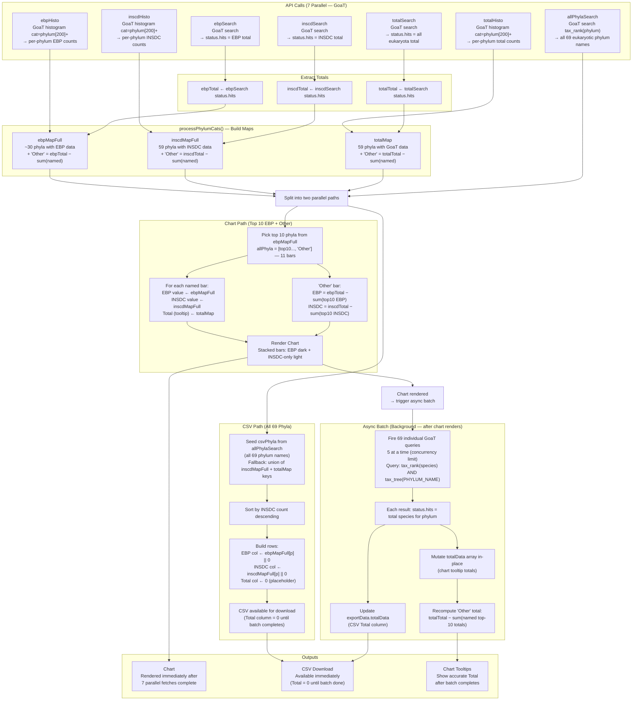

```mermaid
flowchart TD
    subgraph API["API Calls (7 Parallel — GoaT)"]
        A1["ebpSearch\nGoaT search\n→ status.hits = EBP total"]
        A2["ebpHisto\nGoaT histogram cat=phylum[200]+\n→ per-phylum EBP counts"]
        A3["inscdSearch\nGoaT search\n→ status.hits = INSDC total"]
        A4["inscdHisto\nGoaT histogram cat=phylum[200]+\n→ per-phylum INSDC counts"]
        A5["totalSearch\nGoaT search\n→ status.hits = all eukaryota total"]
        A6["totalHisto\nGoaT histogram cat=phylum[200]+\n→ per-phylum total counts"]
        A7["allPhylaSearch\nGoaT search tax_rank(phylum)\n→ all 69 eukaryotic phylum names"]
    end

    subgraph EXTRACT["Extract Totals"]
        B1["ebpTotal ← ebpSearch status.hits"]
        B2["inscdTotal ← inscdSearch status.hits"]
        B3["totalTotal ← totalSearch status.hits"]
    end

    subgraph PROCESS["processPhylumCats() — Build Maps"]
        C1["ebpMapFull\n~30 phyla with EBP data\n+ 'Other' = ebpTotal − sum(named)"]
        C2["inscdMapFull\n59 phyla with INSDC data\n+ 'Other' = inscdTotal − sum(named)"]
        C3["totalMap\n59 phyla with GoaT data\n+ 'Other' = totalTotal − sum(named)"]
    end

    A1 --> B1
    A3 --> B2
    A5 --> B3
    A2 --> C1
    A4 --> C2
    A6 --> C3
    B1 --> C1
    B2 --> C2
    B3 --> C3

    C1 --> SPLIT["Split into two parallel paths"]
    C2 --> SPLIT
    C3 --> SPLIT
    A7 --> SPLIT

    subgraph CHART_PATH["Chart Path (Top 10 EBP + Other)"]
        D1["Pick top 10 phyla from ebpMapFull\nallPhyla = [top10..., 'Other'] — 11 bars"]
        D2["For each named bar:\n  EBP value ← ebpMapFull\n  INSDC value ← inscdMapFull\n  Total (tooltip) ← totalMap"]
        D3["'Other' bar:\n  EBP = ebpTotal − sum(top10 EBP)\n  INSDC = inscdTotal − sum(top10 INSDC)"]
        D4["Render Chart\nStacked bars: EBP dark + INSDC-only light"]
    end

    subgraph CSV_PATH["CSV Path (All 69 Phyla)"]
        E1["Seed csvPhyla from allPhylaSearch\n(all 69 phylum names)\nFallback: union of inscdMapFull + totalMap keys"]
        E2["Sort by INSDC count descending"]
        E3["Build rows:\n  EBP col ← ebpMapFull[p] || 0\n  INSDC col ← inscdMapFull[p] || 0\n  Total col ← 0 (placeholder)"]
        E4["CSV available for download\n(Total column = 0 until batch completes)"]
    end

    SPLIT --> D1
    SPLIT --> E1
    D1 --> D2
    D1 --> D3
    D2 --> D4
    D3 --> D4
    E1 --> E2
    E2 --> E3
    E3 --> E4

    D4 --> ASYNC_TRIGGER["Chart rendered\n→ trigger async batch"]

    subgraph ASYNC["Async Batch (Background — after chart renders)"]
        F1["Fire 69 individual GoaT queries\n5 at a time (concurrency limit)\nQuery: tax_rank(species) AND tax_tree(PHYLUM_NAME)"]
        F2["Each result: status.hits = total species for phylum"]
        F3["Update exportData.totalData\n(CSV Total column)"]
        F4["Mutate totalData array in-place\n(chart tooltip totals)"]
        F5["Recompute 'Other' total:\ntotalTotal − sum(named top-10 totals)"]
    end

    ASYNC_TRIGGER --> F1
    F1 --> F2
    F2 --> F3
    F2 --> F4
    F4 --> F5

    subgraph OUTPUTS["Outputs"]
        G1["Chart\nRendered immediately after\n7 parallel fetches complete"]
        G2["CSV Download\nAvailable immediately\n(Total = 0 until batch done)"]
        G3["Chart Tooltips\nShow accurate Total\nafter batch completes"]
    end

    D4 --> G1
    E4 --> G2
    F3 --> G2
    F5 --> G3
```
