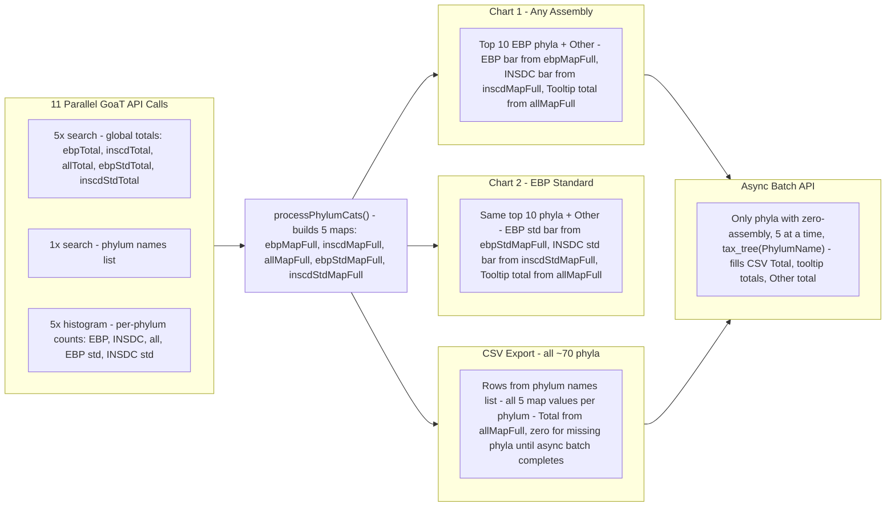

```mermaid
flowchart LR
    subgraph PARALLEL["11 Parallel GoaT API Calls"]
        direction LR
        S1["5x search - global totals: ebpTotal, inscdTotal, allTotal, ebpStdTotal, inscdStdTotal"]
        S2["1x search - phylum names list"]
        H1["5x histogram - per-phylum counts: EBP, INSDC, all, EBP std, INSDC std"]
    end

    PARALLEL --> PROC["processPhylumCats() - builds 5 maps: ebpMapFull, inscdMapFull, allMapFull, ebpStdMapFull, inscdStdMapFull"]

    PROC --> CHART1 & CHART2 & CSV

    subgraph CHART1["Chart 1 - Any Assembly"]
        C1["Top 10 EBP phyla + Other - EBP bar from ebpMapFull, INSDC bar from inscdMapFull, Tooltip total from allMapFull"]
    end

    subgraph CHART2["Chart 2 - EBP Standard"]
        C2["Same top 10 phyla + Other - EBP std bar from ebpStdMapFull, INSDC std bar from inscdStdMapFull, Tooltip total from allMapFull"]
    end

    subgraph CSV["CSV Export - all ~70 phyla"]
        E["Rows from phylum names list - all 5 map values per phylum - Total from allMapFull, zero for missing phyla until async batch completes"]
    end

    CHART1 & CSV --> ASYNC

    subgraph ASYNC["Async Batch API"]
        F["Only phyla with zero-assembly, 5 at a time, tax_tree(PhylumName) - fills CSV Total, tooltip totals, Other total"]
    end
```
